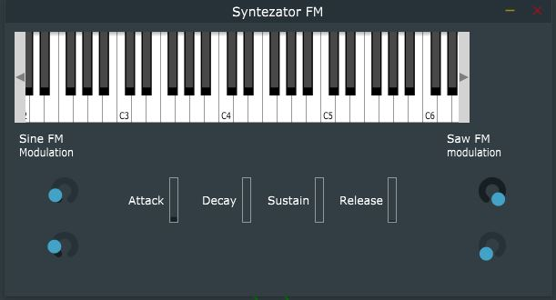

# FM Synthesizer VST

FM (Frequency Modulation) synthesizer VST plugin made for studies. Enables sound shaping with two modulators (1-sine, 2-saw). 
Both modulation index and frequency of modulator wave can be set. 
Effect: from laser tag sound to huge bells, depends on what is needed.

